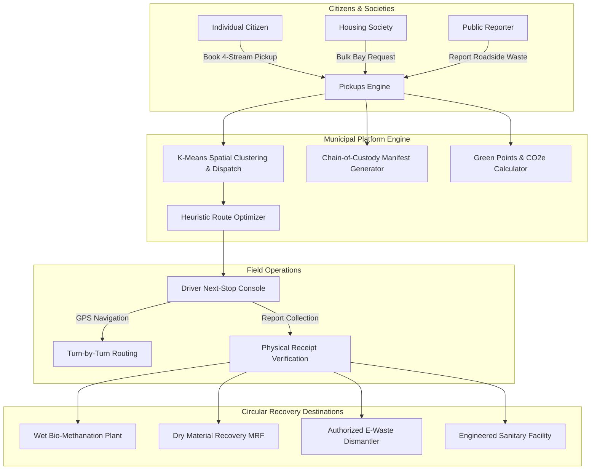

<div align="center">


# NagarLoop (નગરલૂપ)
### *Collect. Recover. Reuse. Repeat.*

[](https://www.python.org/)
[](https://flask.palletsprojects.com/)
[](https://sqlite.org/)
[](https://leafletjs.com/)
[](#-automated-testing)
[](LICENSE)

**NagarLoop** is a full-stack civic technology and municipal logistics platform designed for closed-loop, segregated municipal waste management. It seamlessly bridges residential housing societies, smart collection fleets, and certified circular recycling facilities into a unified, transparent digital ecosystem.

[Explore Features](#-key-features) • [Quick Start](#-quick-start-guide) • [Architecture](#-system-architecture) • [API Reference](#-api-endpoints) • [Default Credentials](#-pre-seeded-demo-accounts)

</div>

---

## 🌟 Key Features

### 1. 🏠 Citizen Doorstep 4-Stream Segregation
- **4 Distinct Waste Streams:** Segregated booking for **Wet Organic (Bio-methanation / Composting)**, **Dry Recyclables (MRF / Plastic Processing)**, **Domestic E-Waste (Authorized Dismantlers)**, and **Residual Domestic Hazardous (Engineered Landfill)**.
- **Smart Google-Maps-Style Location Picker:** Search across Gujarat localities, draggable pin fine-tuning, GPS pinpointing, and automatic reverse geocoding with 6-decimal coordinate accuracy.
- **Verifiable Green Points:** Transparent algorithmic scoring formula incentivizing segregated disposal with impact dashboards tracking CO₂e emissions avoided.

### 2. 🏢 Housing Society Management Portal
- **Bulk Society Bay Bookings:** Dedicated management console for apartment associations and residential societies.
- **Collection Bay Telematics:** Real-time pickup scheduling, volume tracking, and collective society leaderboard rankings.

### 3. 🚚 Driver Shift & Navigation Console
- **Active "Next Stop" Hero Card:** High-contrast, touch-optimized mobile interface for collection drivers.
- **Turn-by-Turn Navigation:** One-tap integration passing exact stored coordinates directly into Google Maps / OpenStreetMap.
- **Collection Verification:** Instant digital receipting, photo upload verification, and problem reporting (e.g., gate locked, unsegregated waste).

### 4. 🛡️ Municipal Command Center (Admin Hub)
- **Live Fleet & Pickup Map:** Real-time spatial tracking of collection vans, pending requests, and facility capacities.
- **Heuristic Route Optimization:** Machine learning KMeans spatial clustering and TSP nearest-neighbor route sequencing to minimize transit time and carbon footprint.
- **Official Municipal Audit Reports:** Instant print-ready audit generation and CSV data export for municipal authorities.

### 5. 🌐 Bilingual & Accessibility First
- **Bilingual Gujarat Localization:** Instant toggle between English and Gujarati (ગુજરાતી).
- **Responsive Mobile Shell:** Designed mobile-first for field operators and citizens while providing an expansive desktop command dashboard.

---

## 🏗️ System Architecture



---

## 🚀 Quick Start Guide

### Prerequisites
- Python 3.10 or higher
- Git

### Installation Steps

1. **Clone the Repository:**
   ```bash
   git clone https://github.com/Jenish07-oss/Nagarloop.git
   cd Nagarloop
   ```

2. **Create and Activate a Virtual Environment:**
   - **On Windows (PowerShell):**
     ```powershell
     python -m venv venv
     .\venv\Scripts\Activate.ps1
     ```
   - **On macOS/Linux:**
     ```bash
     python3 -m venv venv
     source venv/bin/activate
     ```

3. **Install Dependencies:**
   ```bash
   pip install -r requirements.txt
   ```

4. **Initialize and Seed the Database:**
   ```bash
   python seed_data.py
   ```

5. **Start the NagarLoop Application:**
   ```bash
   python app.py
   ```

6. **Open in Browser:**
   Navigate to **`http://127.0.0.1:5000`** in your browser.

---

## 🔑 Pre-Seeded Demo Accounts

NagarLoop comes with pre-configured accounts representing each key stakeholder role:

| Role | Portal URL | Username | Password | Key Responsibilities |
|---|---|---|---|---|
| **Citizen** | `/login/citizen` | `jenish` | `jenish123` | Book doorstep collection, track status, view Green Points & CO₂ impact |
| **Society Manager** | `/login/society_manager` | `society` | `society123` | Manage society bulk collection bays, track society-wide diversion |
| **Fleet Driver** | `/login/driver` | `vikram` | `vikram123` | Execute routes, turn-by-turn navigation, report physical collections |
| **Municipal Admin** | `/login/admin` | `admin` | `admin123` | Fleet dispatch, route optimizer, facility quotas, audit reports & CSV |

---

## 🧪 Automated Testing

NagarLoop includes a comprehensive suite of 63 automated tests verifying API contracts, database transactions, geocoding reliability, route optimization, and role security:

```bash
python -m unittest test_nagarloop.py test_nagarloop_location.py test_mobile_navigation.py test_location_picker_system.py
```

```text
Ran 63 tests in 13.8s
OK (100% tests passed)
```

---

## 📡 API Endpoints

| Method | Endpoint | Description | Auth Required |
|---|---|---|---|
| `GET` | `/api/location/search` | Debounced Gujarat gazetteer and OSM geocoding search | Public |
| `GET` | `/api/location/reverse` | Server-side reverse geocoding to human-readable address | Public |
| `GET` | `/api/pickups` | Retrieve pending/active pickups for spatial mapping | Admin |
| `GET` | `/api/facilities` | Real-time capacity and recovery data for treatment plants | Admin |
| `POST` | `/api/route/optimize` | Run heuristic nearest-neighbor TSP route optimization | Admin |
| `POST` | `/book-pickup` | Create doorstep or society collection booking | Citizen / Society |
| `POST` | `/report-public` | Submit anonymous public civic waste report | Public |

---

## 🛠️ Technology Stack

- **Backend:** Python 3.11, Flask, Jinja2
- **Database:** SQLite3 (Fast, ACID transactional, relational)
- **Machine Learning & Routing:** Scikit-Learn (KMeans spatial clustering), Haversine Matrix TSP Heuristics
- **Frontend & Styling:** Vanilla CSS (NagarLoop Design System - Forest `#0C3B2E` & Lime `#B5E048`), Bootstrap 5 UI Shell
- **Mapping & GIS:** Leaflet.js, OpenStreetMap
- **Data Integrity:** QR Code Generation (`qrcode`, `Pillow`), Cryptographic reference formatting

---

## 📄 License

Distributed under the **MIT License**. See `LICENSE` for more information.

---

<div align="center">
  <sub>Built with ❤️ for Clean, Smart, and Circular Municipalities.</sub>
</div>
